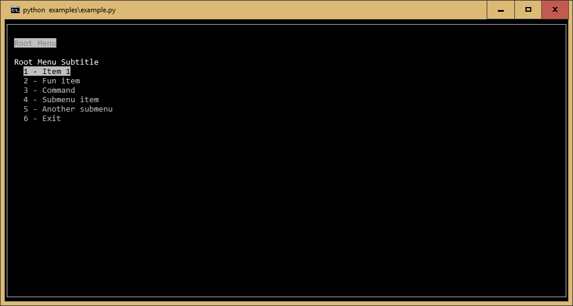

|Build Status|\ |Documentation Status|\ |Coverage Status|

curses-menu
===========

A simple Python menu-based GUI system on the terminal using curses.
Perfect for those times when you need a GUI, but don’t want the overhead
or learning curve of a full-fledged GUI framework. However, it's also
flexible enough to do cool stuff like on-the-fly changing of menus and is extensible to
a large variety of uses.

http://curses-menu.readthedocs.org/en/latest/

Installation
~~~~~~~~~~~~

Tested on Python 3.7+ pypy and pypy3.

The curses library comes bundled with python on Linux and MacOS. Windows
users can visit http://www.lfd.uci.edu/~gohlke/pythonlibs/#curses and
get a third-party build for your platform and Python version.

Then just run

.. code:: shell

   pip install curses-menu

Usage
-----

It’s designed to be pretty simple to use. Here’s an example

.. code:: python

    menu = CursesMenu("Root Menu", "Root Menu Subtitle")
    item1 = MenuItem("Basic item that does nothing", menu)
    function_item = FunctionItem("FunctionItem, get input", input, ["Enter an input: "])
    print(__file__)
    command_item = CommandItem(
        "CommandItem that opens another menu",
        f"python {__file__}",
    )

    submenu = CursesMenu.make_selection_menu([f"item{x}" for x in range(1, 20)])
    submenu_item = SubmenuItem("Long Selection SubMenu", submenu=submenu, menu=menu)

    submenu_2 = CursesMenu("Submenu Title", "Submenu subtitle")
    function_item_2 = FunctionItem("Fun item", input, ["Enter an input"])
    item2 = MenuItem("Another Item")
    submenu_2.items.append(function_item_2)
    submenu_2.items.append(item2)
    submenu_item_2 = SubmenuItem("Short Submenu", submenu=submenu_2, menu=menu)

    menu.items.append(item1)
    menu.items.append(function_item)
    menu.items.append(command_item)
    menu.items.append(submenu_item)
    menu.items.append(submenu_item_2)

    menu.start()
    _ = menu.join()

Testing Information
-------------------

Currently the platforms I'm manually testing on are MacOS in iTerm2 on zsh with and without TMUX and Windows 10\
with both powersehll and cmd.exe in and out of Windows Terminal. If a bug pops up on another configuration, \
no promises that I'll be able to reproduce it.

.. |Build Status| image:: https://github.com/pmbarrett314/curses-menu/actions/workflows/github-action-tox.yml/badge.svg
   :target: https://github.com/pmbarrett314/curses-menu/actions/workflows/github-action-tox.yml/badge.svg
.. |Documentation Status| image:: https://readthedocs.org/projects/curses-menu/badge/?version=latest
   :target: http://curses-menu.readthedocs.org/en/latest/?badge=latest
.. |Coverage Status| image:: https://coveralls.io/repos/github/pmbarrett314/curses-menu/badge.svg?branch=develop
   :target: https://coveralls.io/github/pmbarrett314/curses-menu?branch=develop
